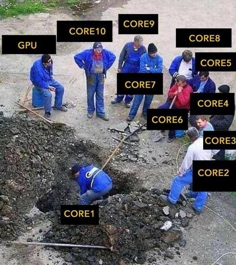

# Benchmarks #

Comparative performance benchmarks for testing **Ultra Engine 1.0** against **Unity 2019**.

When we create benchmarks, we attempt to isolate one system at a time and create a stress test that identifies potential bottlenecks. This is not because we plan to create a game with 1000 characters or 100,000 boxes onscreen (although you could), but because we understand that all of these rates will contribute to our game's final performance. It would be confusing and complicated to try to test all of these features at once, so we separate out the functionality into several tests, and attempt tp push the system to its limits in each.

## Metrics ##

The following metrics are measured:
- Framerate (FPS). Higher is better.
- GPU utilization (%). Higher is better.
- CPU utilization (%). This isn't critical in our evaluation, but can be an indicator of what is going on.

High GPU utilization is considered desirable. This ensures the graphics card is not sitting idle. CPU usage is neutral for the purposes of these tests, but if we encounter a situation where the CPU usage is high but the GPU utilization is low, this is known as "GPU starvation" and is to be prevented.

In visual terms, this is the situation we want to avoid:

## System Requiresments ##
- Vulkan 1.1
- Windows

## Benchmarking Tests ##

The following programs are used to test both engines under a variety of conditions. Tests are made as simple as possible to ensure both engines are performing the same workload.

All tests are performed with an Nvidia GEForce 2060 GPU. 

### Animation ###

This test evaluates each engine's efficiency when performing skinned animation. Each model has a unique skeleton that animates independently.

In Ultra Engine GPU skinning is always enabled. In Unity, GPU skinning is enabled with the maximum bones set to four. I did not know how to start the animation at a random frame in Unity, otherwise I would have to show that each skeleton is unique.

The model used is low-polygon (around 1200 triangles) because we are trying to test the animation system, not the GPU vertex pipeline speed.

### Lighting ###

This test evaluates the general speed of dynamic point light rendering in each engine. Ultra Engine is using a forward renderer, but this is not a pure forward vs. deferred test. GPU utilization and framerate are higher in Ultra Engine, so I attribute this to our rendering code.

### Unique Geometry ###

This test evaluates efficiency when drawing a large number of unique models, as we would see in a game. Each box is unique and not instanced, with frustum culling performed on the CPU on all objects. "Static batching" in Unity is disabled, because that would disable the functionality we are trying to test.

### Instanced Geometry ###

This test evaluates the engine's efficiency when managing and culling large numbers of instanced objects. A single box is instanced to form a 48x48x48 grid of 110,592 objects). It is possible to perform occlusion culling on the GPU (see chapter four in *Game Engine Gems 3*) but we specifically want to test the speed of the frustum culling performed on the CPU. To verify that culling is being performed, both engines have a free-look camera implemented.

